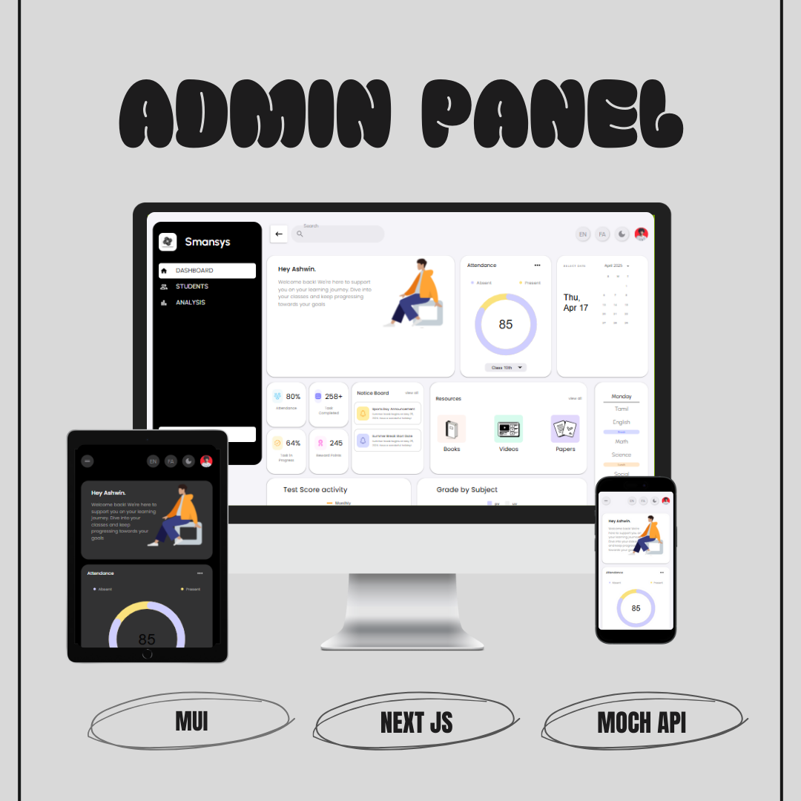
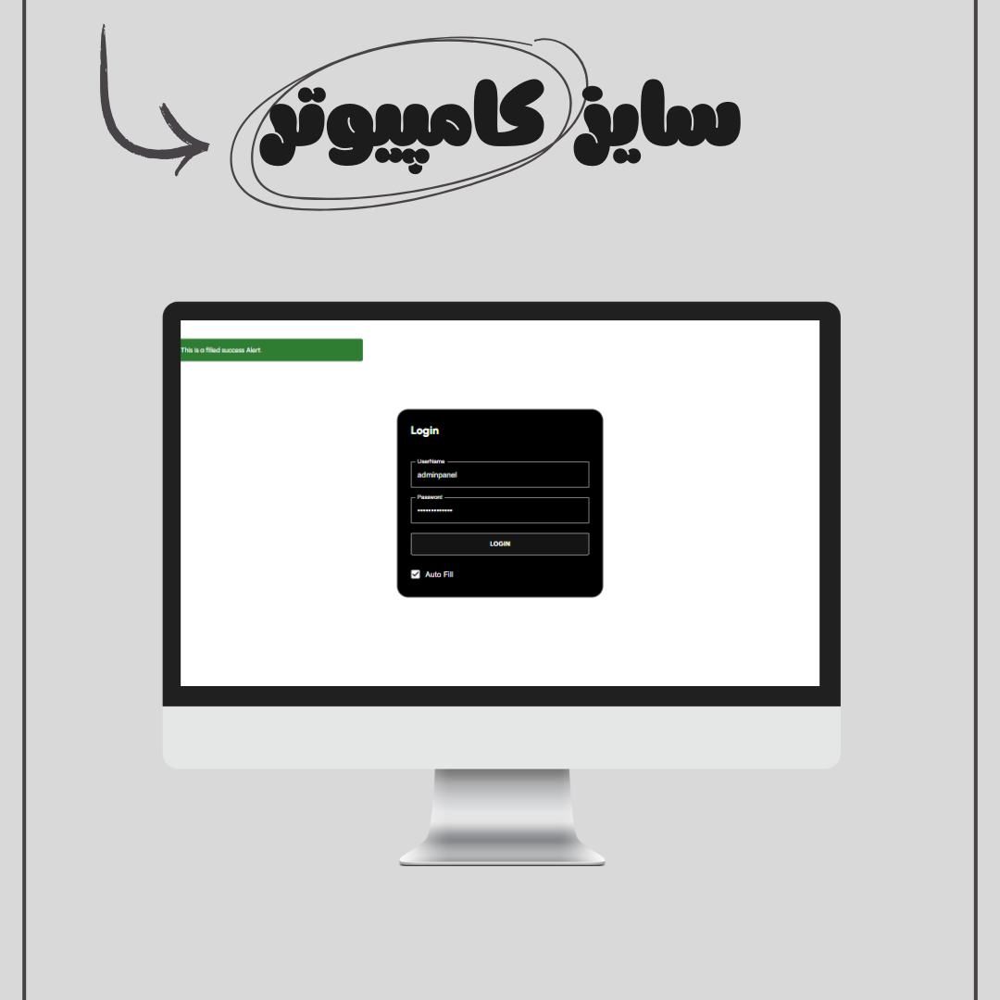
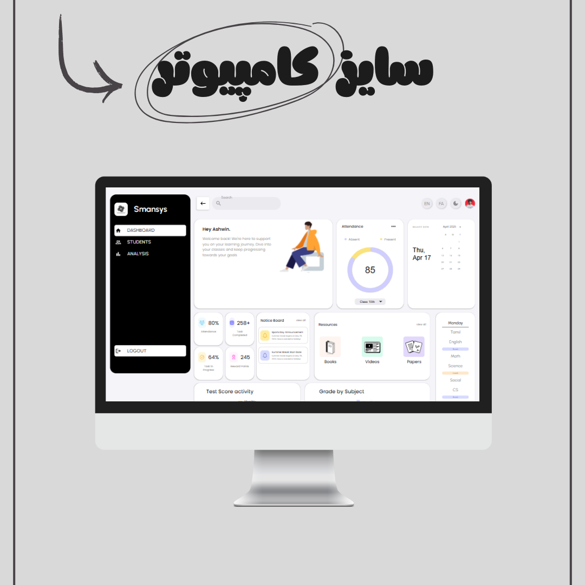
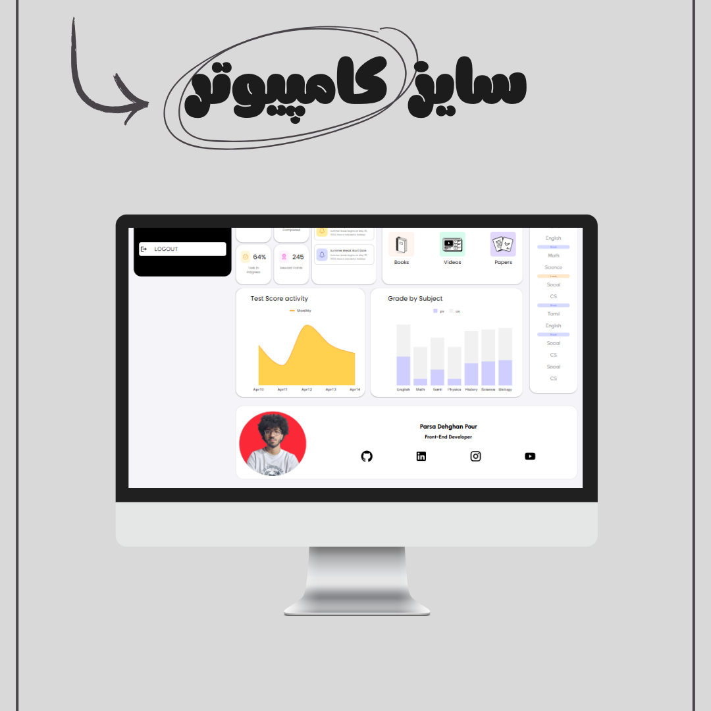
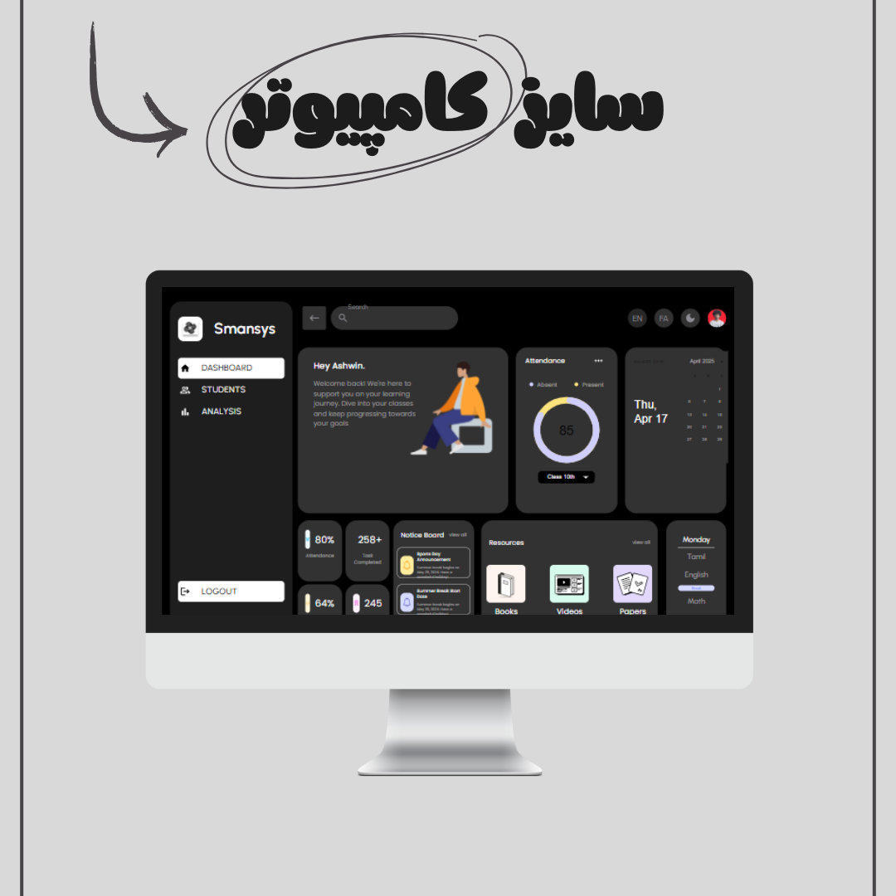
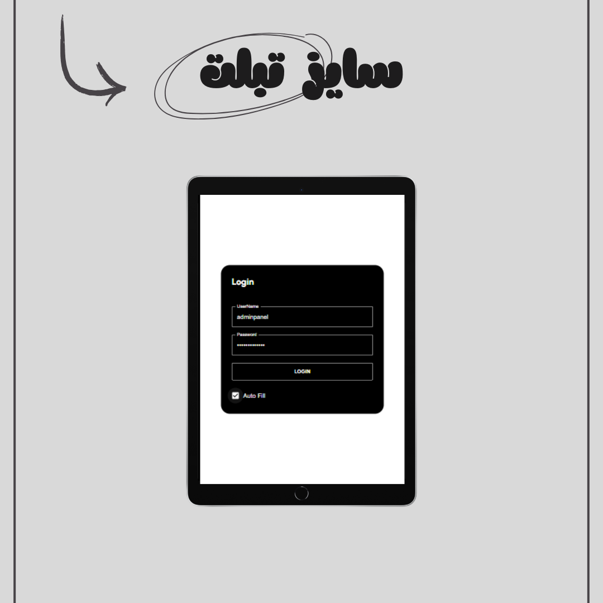
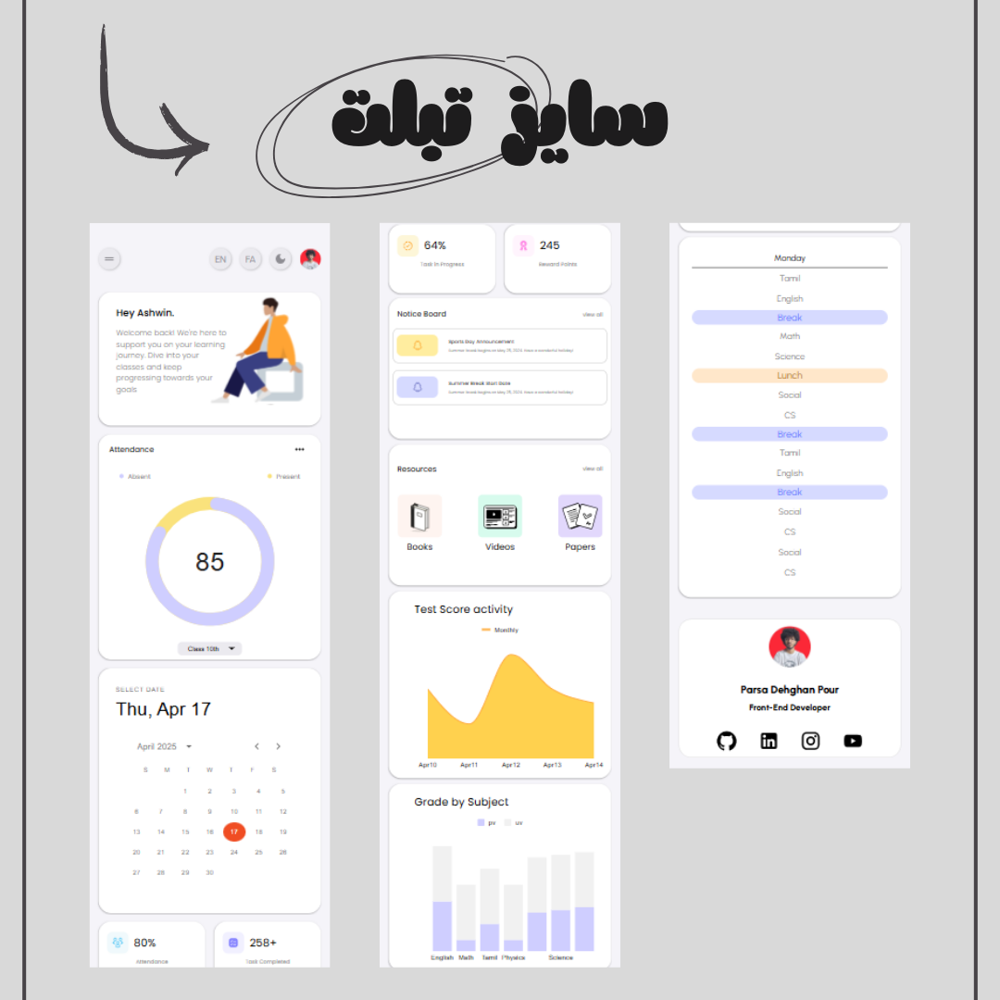
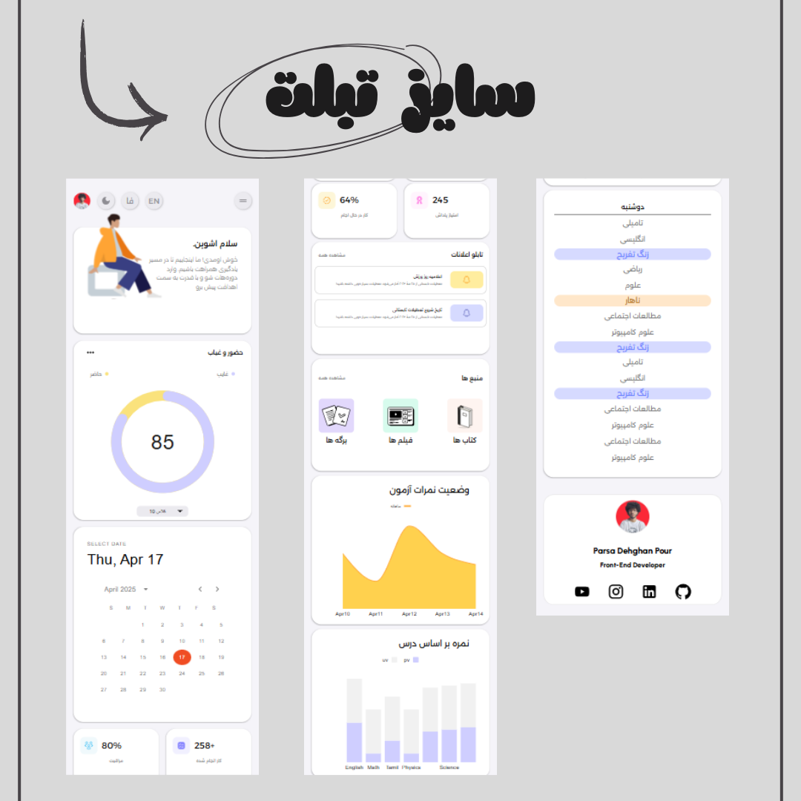
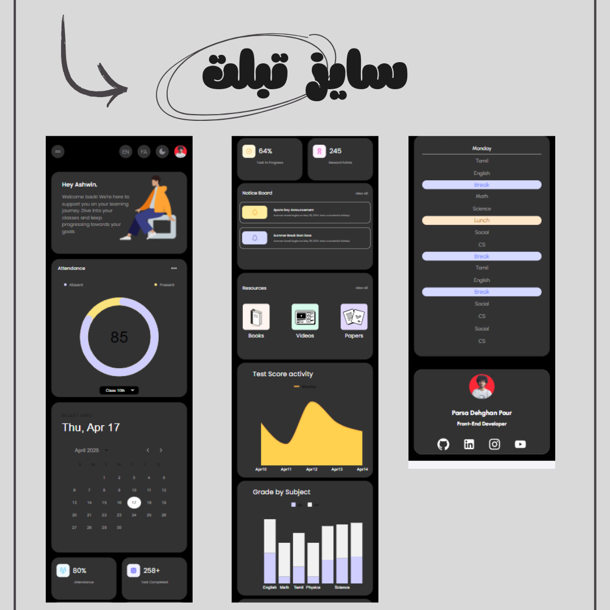
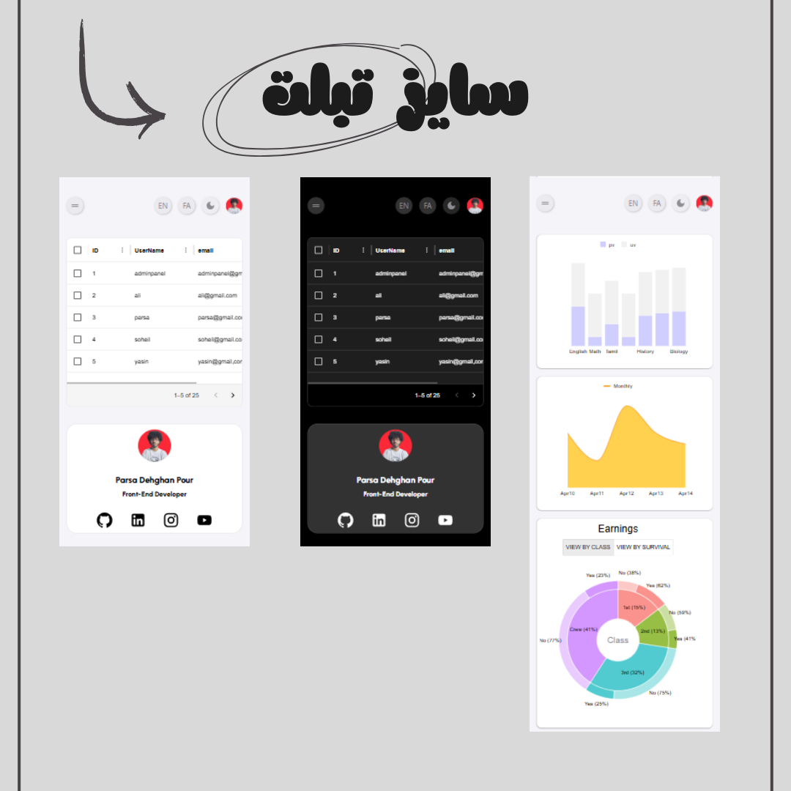

# 🧩 Modern Admin Panel – Next.js & MUI

A **modern and professional Admin Panel** built with **Next.js** and **Material UI (MUI)**  
Featuring **Dark / Light Mode**, **Persian & English languages**, **Login system with MockAPI**, and a fully functional **Analytics Dashboard** with Skeleton Loading.

---

## 🎛️ Project Features

- 🔐 **Authentication System**

  - Login page implemented
  - User authentication using **MockAPI**
  - Login state management

- 🌙☀️ **Dark & Light Mode**

  - Fully dynamic theme switching
  - Implemented with **MUI Theme Provider**

- 🌐 **Multi Language (FA / EN)**

  - Persian (RTL) & English (LTR) support
  - Instant language switching

- 📊 **Dashboard Analytics**

  - Professional admin dashboard
  - Analytics and statistical data display

- 🎓 **Students Management Page**

  - Students data rendering
  - Clean and structured UI

- ⏳ **Skeleton Loading**

  - Loading state handled with **MUI Skeleton**
  - Better UX while fetching data

- 🧠 **Global State Management**

  - Data handled using **React useContext**
  - Clean architecture & no prop drilling

- 📱 **Fully Responsive**
  - Optimized for Desktop, Tablet, and Mobile

---

## 🧪 Technologies Used

- **Next.js**
- **React**
- **Material UI (MUI)**
- **MockAPI**
- **JavaScript / JSX**
- **useContext**

---

## 🚀 Live Demo

👉 https://admin-panel-bkq.pages.dev/

---

## 🖼️ Project Screenshots

### 🌟 Overview

### 💻 Desktop View

### 📱 Tablet View

---

---

## 📅 Release Date

**29 December 2025**

---

## 👨‍💻 Developer

**Parsa Dehghan Pour Farashah**

---

## 👨‍🏫 Supervisor

🔗 https://trainingsitedesign.ir/

---

## 🌐 Social Links

- 📸 Instagram: [@parsa_dehghanpour_dv](https://www.instagram.com/parsa_dehghanpour_dv?igsh=eHkwNWhsa3I4ZWVp)

- 💼 LinkedIn: [Parsa Dehghan Pour Farashah](http://linkedin.com/in/parsa-dehghan-pour-farashah-85ab04250)

- 💻 GitHub: [parsa-farshah](http://github.com/parsa-farshah)

- 📩 Email: parsafarashah2002@gmail.com

- 📺 YouTube: [@FrontEndFresh](https://youtube.com/@frontendfresh?si=-2WsIYe-KBTUfwyu)

- Codepen : [@parsa-dehghan](https://codepen.io/parsa-dehghan)
